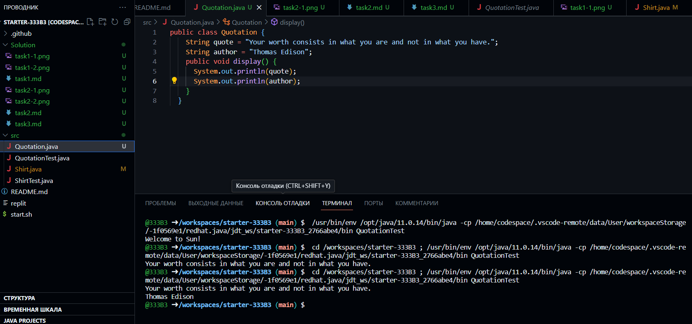
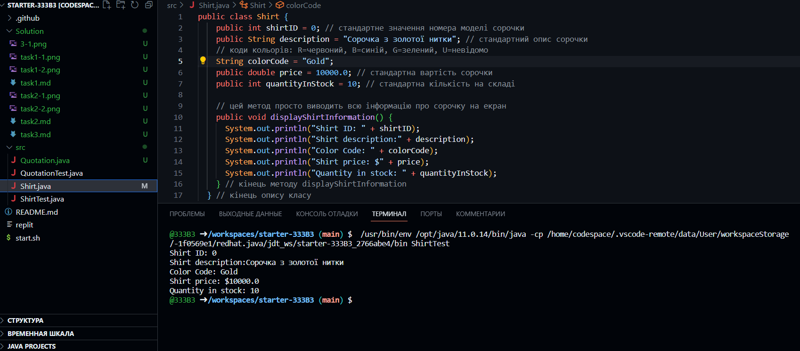

```java
public class Quotation {
    String quote = "Your worth consists in what you are and not in what you have.";
    String author = "Thomas Edison";
    public void display() {
      System.out.println(quote);
      System.out.println(author);
    }
  }
```

```java
public class Shirt {
    public int shirtID = 0; // стандартне значення номера моделі сорочки
    public String description = "Сорочка з золотої нитки"; // стандартний опис сорочки
    // коди кольорів: R=червоний, B=синій, G=зелений, U=невідомо
    String colorCode = "Gold";
    public double price = 10000.0; // стандартна вартість сорочки
    public int quantityInStock = 10; // стандартна кількість на складі
    
    // цей метод просто виводить всю інформацію про сорочку на екран
    public void displayShirtInformation() {
      System.out.println("Shirt ID: " + shirtID);
      System.out.println("Shirt description:" + description);
      System.out.println("Color Code: " + colorCode);
      System.out.println("Shirt price: $" + price);
      System.out.println("Quantity in stock: " + quantityInStock);
    } // кінець методу displayShirtInformation
  } // кінець опису класу
```